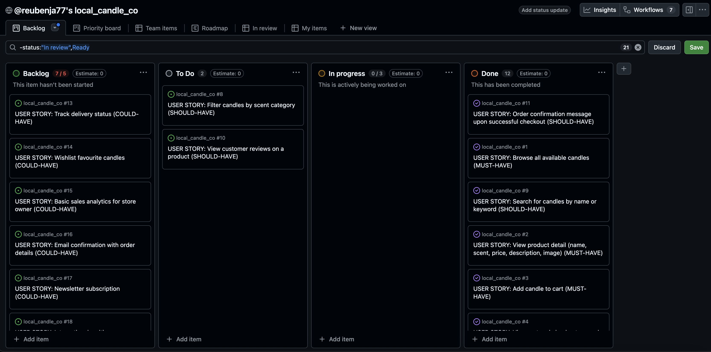
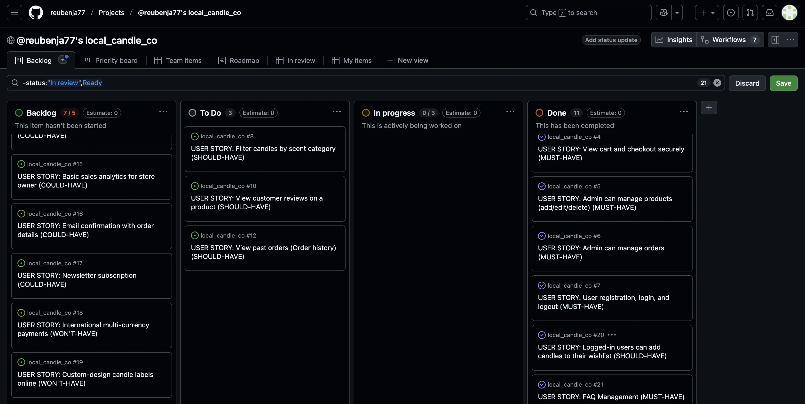
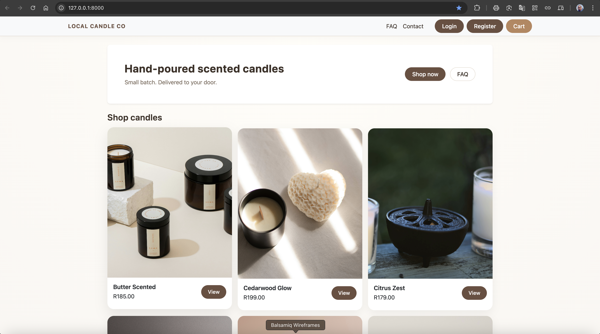
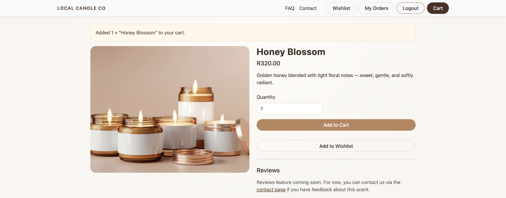
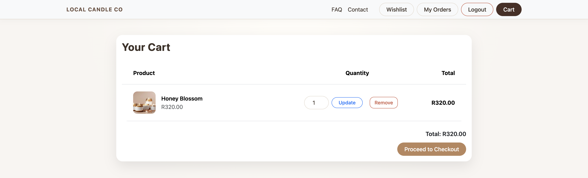
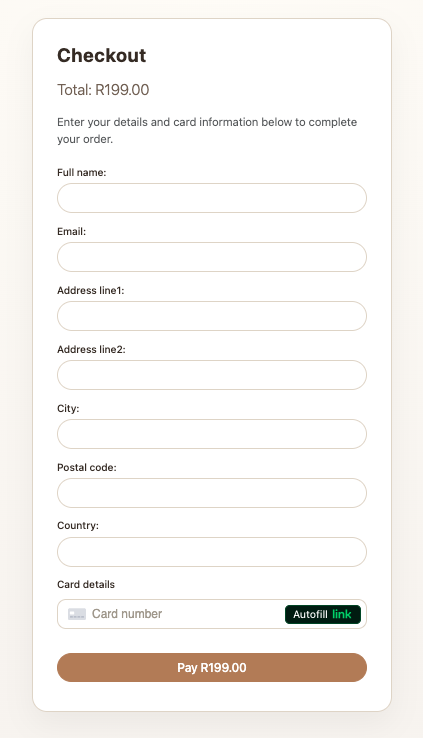
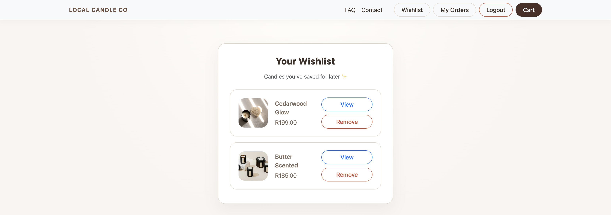
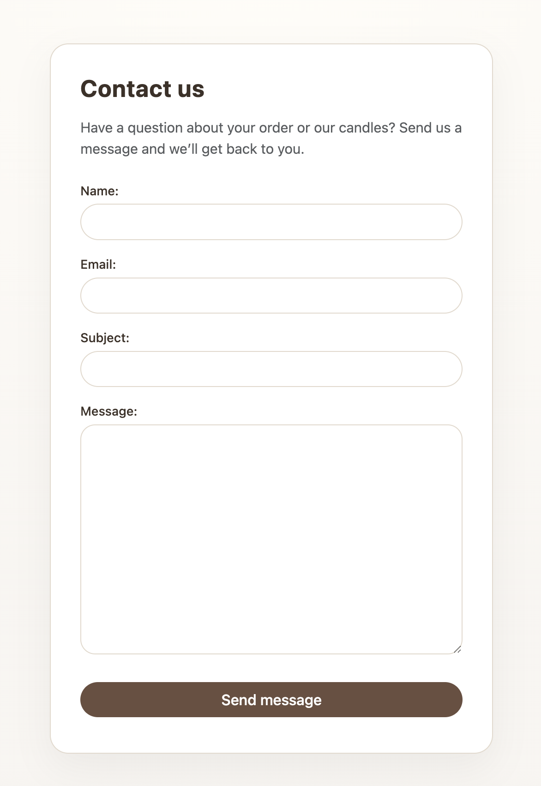
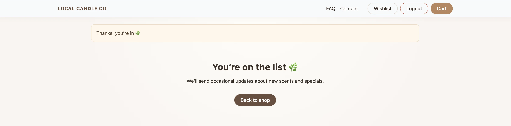
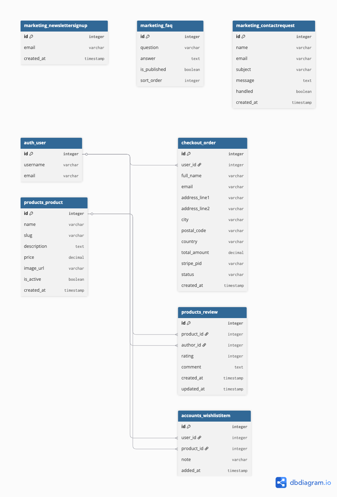

# local_candle_co
Hand-poured scented candles. Small batch. Delivered.

## 1. Introduction

Local Candle Co is a fully functional e-commerce application built using Django, featuring product browsing, cart management, checkout and payment processing using Stripe, user authentication with Django-Allauth, wishlist functionality, newsletter signup, FAQ management, and a contact system.

This project is my Portfolio Project for the E-Commerce Applications module. It demonstrates a full-stack cloud-hosted online store with marketing tools, SEO, UX design, and secure authentication.
💻 [Visit live website](https://local-candle-co-8ac3df963878.herokuapp.com/)  
(Ctrl + click to open in new tab)

## 2. Business Model

Local Candle Co follows a straightforward e-commerce business model, focusing on single-purchase retail through a product catalogue.

### 2.1 Business Type

B2C (Business to Consumer) retail of scented candles.

### 2.2 Revenue Model
- Direct product sales through a checkout system powered by Stripe.
- No subscriptions or recurring payments.
- Newsletter allows for future promotions and product launches.

### 2.3 Customer Segment
- Home décor enthusiasts
- Gift buyers
- Candle lovers who prefer artisanal, hand-poured products
- Customers seeking locally sourced candles

### 2.4 Value Proposition
- Hand-crafted, small-batch candles
- Simple, fast checkout
- Quality scents
- Fast delivery
- Easy communication through built-in contact form

### 2.5 Customer Acquisition
- SEO
- Newsletter signups
- Facebook business page mockup (marketing presence)
- Clean UX design that reduces friction in browsing and purchasing

### 2.6 Reason for Authentication
Users create accounts to:
- Save wishlist items
- View order details in email
- Save contact details for future purchases

## 3. UX Design
### 3.1 Project Goals
- Provide a simple, beautiful candle store
- Let users browse and purchase easily
- Allow admin to manage catalogue, orders, FAQs, and contact messages
- Include marketing features (newsletter, SEO, mock Facebook page)
- Provide accessible UX with clean navigation and messaging

### 3.2 Target Audience
- Adults aged 20–50
- Online shoppers looking for décor items
- Gift buyers

### 3.3 User Stories
#### MUST-HAVES:
- Browse all available candles
- View product detail
- Add candle to cart
- View cart and checkout securely
- Admin can manage products
- Admin can manage orders
- User registration, login & logout
- Wishlist items
- Newsletter signup
- Contact the store
- View FAQs

### 3.4 Wireframes
> - Home / Product list  

> - Product detail
  
> - Cart
  
> - Checkout
  
> - Wishlist

> - Contact Us

> - Newsletter

> - Footer

### 3.5 Entity Relationship Diagram (ERD)

### 3.6 Design Choices
REMEMBER: Elaborate on below section
- Bootstrap for responsive design
- Neutral colour palette (cream, olive, charcoal)
- Clean serif + sans-serif fonts
- Minimal layout to place focus on product photos

## 4. Features
### Implemented Features
- Browse products
- Product detail pages
- Wishlist
- Session-based cart
- Checkout with Stripe
- Order creation
- Contact form
- Newsletter signup
- FAQ page
- Admin management for products, reviews, FAQs, contacts, orders
- SEO (meta tags, robots.txt, sitemap.xml)
- Custom error pages (404, 500)
- Mock Facebook business page link in footer 

### Future Features
- Product reviews
- Coupon codes
- Delivery tracking
- Product categories

## 5. Technologies Used
### 5.1 Backend:
- Python
- Django
- Django Allauth (authentication)
- Django Sitemaps

### 5.2 Frontend
- Bootstrap 5
- HTML5, 
- CSS3

### 5.3 Payments
- Stripe PaymentIntent API

### 5.4 Hosting
- Heroku
- Gunicorn
- Whitenoise / Cloudinary Storage

## 6. SEO Implementation
- Meta description tags on key pages
- `robots.txt`
- `sitemap.xml`
- Friendly URLs
- Human-readable page titles
- Internal linking via navbar and footer
- No lorem ipsum
- 404 and 500 pages with correct responses

## 7. Testing

A full detailed testing document is available here:

🔗 **[View Full Testing Document](TESTING.md)**

The testing document includes:
- Manual feature testing
- User story testing
- Validator testing (HTML, CSS, Python)
- Lighthouse accessibility checks
- Browser/device testing
- Bugs and fixes

## 8. Deployment
[Official Page](https://devcenter.heroku.com/articles/git) (Ctrl + click)
### Heroku Deployment Steps:
1. Create a new Heroku app.

2. Set `DATABASE_URL`, `SECRET_KEY`, `STRIPE_PUBLIC_KEY`, `STRIPE_SECRET_KEY`, etc. in Heroku Config Vars.

3. Connect the app to the GitHub repository.

4. Set buildpacks (e.g. `heroku/python`).

5. Deploy the `main` branch and run migrations.

6. Confirm that the deployed site matches the local development version.

## 9. Credits
RMEMBER: Add referrences here
Product photos: Unsplash/Pexels placeholders
Inspiration from Boutique Ado project

