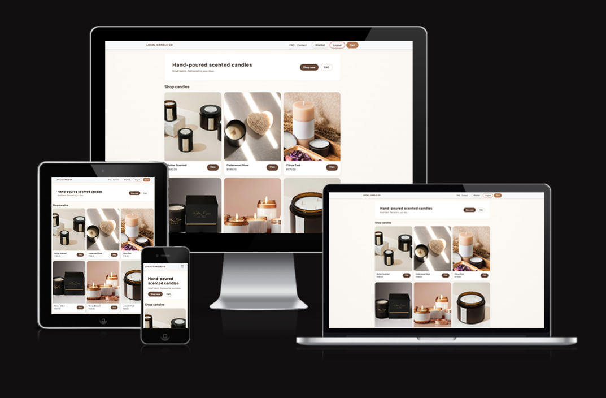
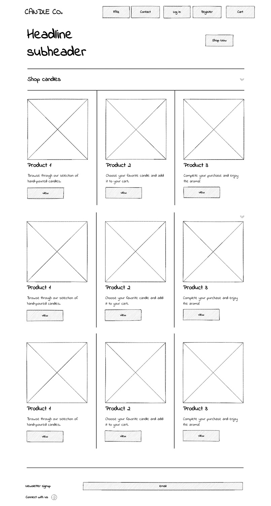
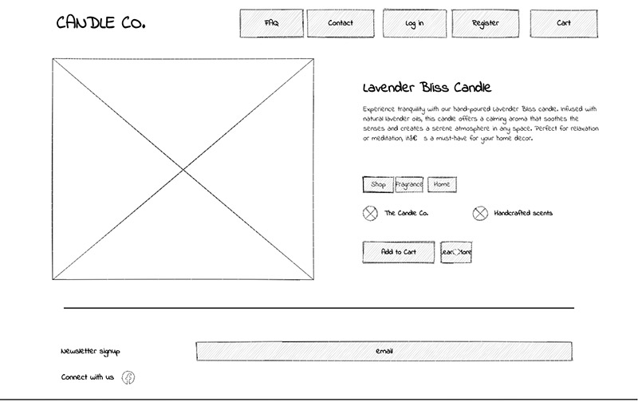
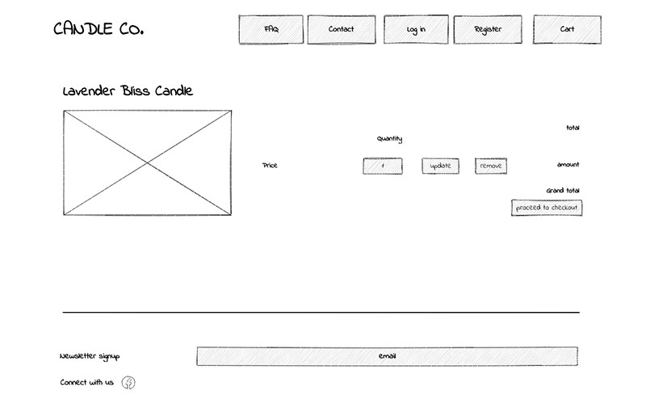
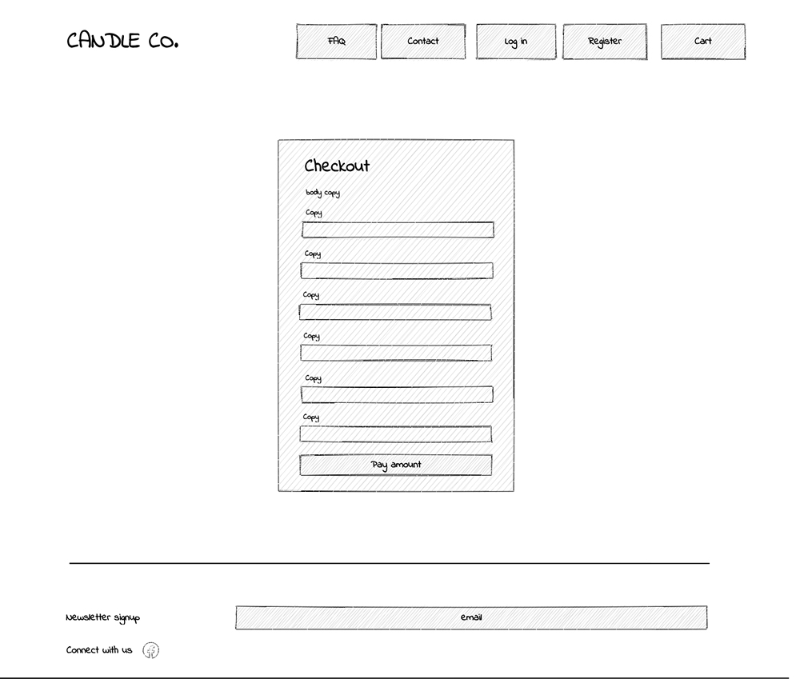
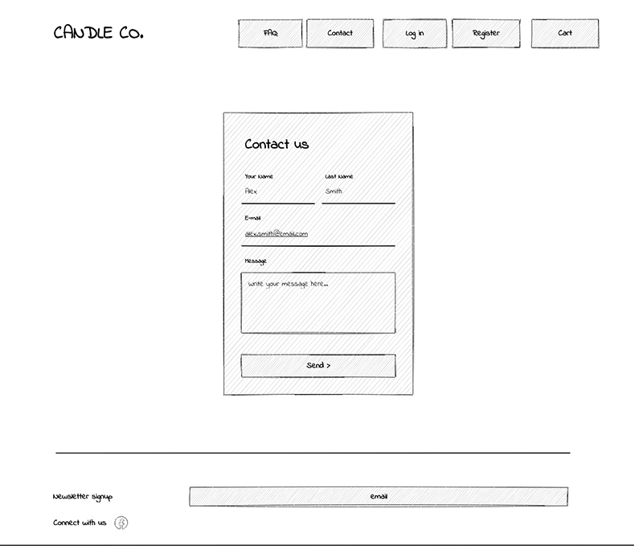
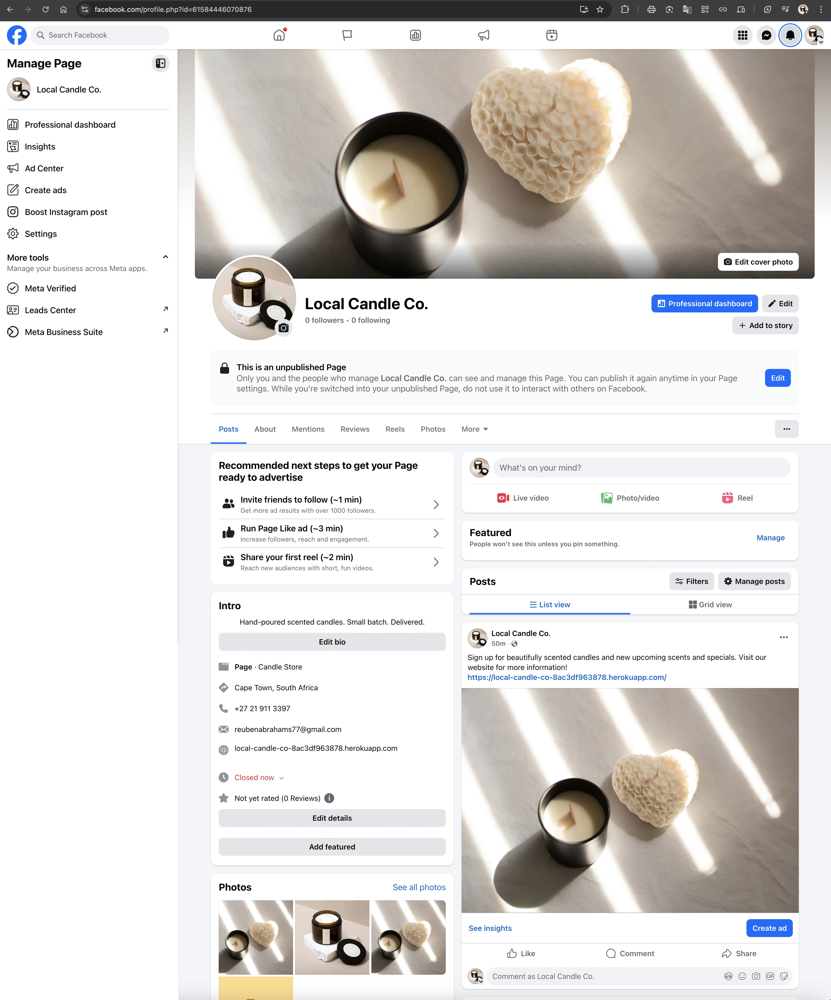

# local_candle_co
Hand-poured scented candles. Small batch. Delivered.

## Table of Contents

- [Introduction](#introduction)
- [Business Model](#business-model)
  - [Business Type](#business-type)
  - [Revenue Model](#revenue-model)
  - [Customer Segment](#customer-segment)
  - [Value Proposition](#value-proposition)
  - [Customer Acquisition](#customer-acquisition)
  - [Reason for Authentication](#reason-for-authentication)
- [UX Design](#ux-design)
  - [Project Goals](#project-goals)
  - [Target Audience](#target-audience)
  - [User Stories](#user-stories)
  - [Wireframes](#wireframes)
  - [Entity Relationship Diagram (ERD)](#entity-relationship-diagram-erd)
  - [Design Choices](#design-choices)
- [Features](#features)
  - [Implemented Features](#implemented-features)
  - [Future Features](#future-features)
- [Technologies Used](#technologies-used)
  - [Backend](#backend)
  - [Frontend](#frontend)
  - [Payments](#payments)
  - [Hosting](#hosting)
- [SEO Implementation](#seo-implementation)
- [Testing](#testing)
- [Code Validation (PEP8)](#code-validation-pep8)
- [Deployment](#deployment)
- [Credits](#credits)

---

## Introduction

Local Candle Co is a fully functional e-commerce application built using Django, featuring product browsing, cart management, checkout and payment processing using Stripe, user authentication with Django-Allauth, wishlist functionality, newsletter signup, FAQ management, and a contact system.

This project is my Portfolio Project for the E-Commerce Applications module. It demonstrates a full-stack cloud-hosted online store with marketing tools, SEO, UX design, and secure authentication.

 

💻 [Visit live website](https://local-candle-co-8ac3df963878.herokuapp.com/)  
(Ctrl + click to open in new tab)

---

## Business Model

Local Candle Co follows a straightforward e-commerce business model, focusing on single-purchase retail through a product catalogue.

### Business Type

B2C (Business to Consumer) retail of scented candles.

### Revenue Model
- Direct product sales through a checkout system powered by Stripe.
- No subscriptions or recurring payments.
- Newsletter allows for future promotions and product launches.

### Customer Segment
- Home décor enthusiasts
- Gift buyers
- Candle lovers who prefer artisanal, hand-poured products
- Customers seeking locally sourced candles

### Value Proposition
- Hand-crafted, small-batch candles
- Simple, fast checkout
- Quality scents
- Fast delivery
- Easy communication through built-in contact form

### Customer Acquisition
- SEO
- Newsletter signups
- Facebook business page mockup (marketing presence)
- Clean UX design that reduces friction in browsing and purchasing

### Reason for Authentication
Users create accounts to:
- Save wishlist items
- View order details in email
- Save contact details for future purchases

---

## UX Design
### Project Goals
- Provide a simple, beautiful candle store
- Let users browse and purchase easily
- Allow admin to manage catalogue, orders, FAQs, and contact messages
- Include marketing features (newsletter, SEO, mock Facebook page)
- Provide accessible UX with clean navigation and messaging

### Target Audience
- Adults aged 20–50
- Online shoppers looking for décor items
- Gift buyers

### User Stories
#### MUST-HAVES:
- Browse all available candles
- View product detail
- Add candle to cart
- View cart and checkout securely
- Admin can manage products
- Admin can manage orders
- User registration, login & logout
- Wishlist items
- Newsletter signup
- Contact the store
- View FAQs

### Wireframes
####  Home / Product list  

####  Product detail
  
#### Cart
  
####  Checkout
  
####  Contact Us

### Entity Relationship Diagram (ERD)

### Design Choices
REMEMBER: Elaborate on below section
- Bootstrap for responsive design
- Neutral colour palette (cream, olive, charcoal)
- Clean serif + sans-serif fonts
- Minimal layout to place focus on product photos

---

## Features
### Implemented Features
- Browse products
- Product detail pages
- Wishlist
- Session-based cart
- Checkout with Stripe
- Order creation
- Contact form
- Newsletter signup
- FAQ page
- Admin management for products, reviews, FAQs, contacts, orders
- SEO (meta tags, robots.txt, sitemap.xml)
- Custom error pages (404, 500)
- Mock Facebook Business Page

### Future Features
- Product reviews
- Coupon codes
- Delivery tracking
- Product categories

---

## Technologies Used
### Backend:
- Python
- Django
- Django Allauth (authentication)
- Django Sitemaps

### Frontend
- Bootstrap 5
- HTML5, 
- CSS3

### Payments
- Stripe PaymentIntent API

### Hosting
- Heroku
- Gunicorn
- Whitenoise

---

## SEO Implementation
The application includes a dynamically generated sitemap and robots.txt file.
These reference the deployed production URL and ensure proper indexing by search engines.
- `robots.txt`
- `sitemap.xml`
- Meta description tags on key pages
- Friendly URLs
- Human-readable page titles
- Internal linking via navbar and footer
- No lorem ipsum
- 404 and 500 pages with correct responses

---

## Marketing

### Mock Facebook Business Page

A **Mock Facebook Business Page** was created for Local Candle Co. This demonstrates how the brand would be promoted on social media to attract customers, build trust, and support product sales.

This page is **unpublished** and used solely for academic assessment. It visually represents how Local Candle Co would establish an online marketing presence.

#### Purpose of the Mock Facebook Page
- Showcase brand identity through consistent visuals  
- Demonstrate a real-world marketing channel for customer acquisition  
- Provide a location for users to “follow” for updates and specials  
- Align with portfolio expectations for demonstrating marketing methodology  
- Reinforce credibility beyond the website  

#### Page Includes:
- Cover photo featuring product imagery  
- Profile picture of candle product  
- Bio describing the brand  
- Contact information  
- Sample promotional post linking to the live Heroku deployment  
- Featured photos  
- Location and business category  
- Embedded post preview  

#### Screenshot of Mock Facebook Page

Below is the full screenshot of the unpublished page:

> **Note:** This screenshot is stored in the repository here:  
`static/images/fb-page.png`

---

## Testing

A full detailed testing document is available here:

🔗 **[View Full Testing Document](TESTING.md)**

---

## Deployment
[Official Page](https://devcenter.heroku.com/articles/git) (Ctrl + click)
### Heroku Deployment Steps:
1. Create a new Heroku app.

2. Set `DATABASE_URL`, `SECRET_KEY`, `STRIPE_PUBLIC_KEY`, `STRIPE_SECRET_KEY`, etc. in Heroku Config Vars.

3. Connect the app to the GitHub repository.

4. Set buildpacks (e.g. `heroku/python`).

5. Deploy the `main` branch and run migrations.

6. Confirm that the deployed site matches the local development version.

## Credits
### Reference Material & Learning Resources

The following websites were used throughout development for guidance,
documentation, and best practices:

- **Django Documentation**  
  https://docs.djangoproject.com/  
  Official documentation used for models, forms, admin, URL routing,
  static files, and deployment settings.

- **Stripe Documentation**  
  https://stripe.com/docs  
  Used for implementing PaymentIntent, client secret handling,
  and understanding the checkout flow.

- **Bootstrap 5 Documentation**  
  https://getbootstrap.com/docs/5.0/getting-started/introduction/  
  For layout grids, utilities, spacing, and responsive components.

- **W3Schools**  
  https://www.w3schools.com/  
  General HTML, CSS, and JavaScript references.

- **MDN Web Docs (Mozilla Developer Network)**  
  https://developer.mozilla.org/  
  For CSS behaviour, accessibility, ARIA attributes, and semantic HTML.

- **Code Institute Course Material**  
  Django and Stripe lessons from the *Boutique Ado* walkthrough provided structural guidance, best practices,
  and deployment patterns.

- **Django-Allauth Documentation**  
  https://django-allauth.readthedocs.io/  
  For login, logout, registration, email fields, and templates.

- **Code Institute**  
  Code structure inspired by Boutique Ado walkthrough project

### Media
#### Product images:
- **Unsplash**  
  https://unsplash.com/  
  Source of product placeholder photos (free commercial use license).

- **Pexels**  
  https://pexels.com/  
  Additional product images under a free license.

#### Icons:
- Font Awesome
- Emoji symbols (unicode)

#### Tools:
- **dbdiagram.io**  
  https://dbdiagram.io  
  Used to create the Entity Relationship Diagram (ERD).

- **uizard.io**  
  https://app.uizard.io  
  Used to create wireframes.

#### Acknowledgements:
Thanks goes to my mentor, Rory Sheridan, for his motivating words of encouragement, advice and guidance through not only this project but also the other 4 milestone projects.

