# TESTING

This document covers all testing completed for **Local Candle Co**, including:

- Manual feature testing  
- User story testing  
- Form validation  
- Authentication & authorization  
- Cart, quantity and checkout testing  
- Email confirmation  
- CRUD testing (FAQ)  
- Lighthouse accessibility  
- HTML, CSS, Python/Pep8 validation  
- Browser/device testing  
- Bugs and fixes  

---

## 1. Manual Feature Testing

All manual tests were completed using:

- Chrome (desktop + mobile)
- Firefox
- Safari (mobile)
- Django development server

---

## 1.1 Navigation Bar


| Test | Expected Result | Pass |
|------|------------------|------|
| Navbar loads on all pages | Visible & styled | ✔️ |
| Mobile shows burger dropdown | Dropdown opens from right | ✔️ |
| Logged-out links show: Login, Register | Correct visibility | ✔️ |
| Logged-in links show: Wishlist, Logout | Correct visibility | ✔️ |
| Cart button always visible | Works & redirects | ✔️ |

---

## 1.2 Product List Page

 
| Test | Result |
|------|--------|
| Products display in cards | ✔️ PASS |  |
| View button correctly sized | ✔️ PASS |
| Cards respond to hover | ✔️ PASS |
| Images load correctly | ✔️ PASS |

---

## 1.3 Product Detail Page


| Test | Result |
|------|--------|
| Product image loads | ✔️ PASS |
| Quantity selector appears | ✔️ PASS |
| Add to Cart adds correct qty | ✔️ PASS |
| Wishlist button visible | ✔️ PASS |

---

## 1.4 Wishlist


| Test | Result |
|------|--------|
| Add to wishlist (auth only) | ✔️ PASS |
| Remove from wishlist | ✔️ PASS |
| Wishlist page shows correct items | ✔️ PASS |
| Unauthorized users redirected to login | ✔️ PASS |

---

## 1.5 Cart & Quantity Updates


| Test | Result |
|------|--------|
| Add to cart with quantity | ✔️ PASS |
| Cart displays line totals | ✔️ PASS |
| Cart shows quantity update form | ✔️ PASS |
| Update quantity changes totals | ✔️ PASS |
| Removing an item works | ✔️ PASS |
| Cart clears after checkout | ✔️ PASS |

---

## 1.6 Checkout


| Test | Result |
|------|--------|
| Checkout form validates | ✔️ PASS |
| Stripe PaymentIntent created | ✔️ PASS |
| Order saved as "paid" | ✔️ PASS |
| Success page shown | ✔️ PASS |
| Empty cart redirects to home | ✔️ PASS |

---

## 1.7 Order Confirmation Email

### Steps
| Test Area         | Description                                                        |
| ----------------- | ------------------------------------------------------------------ |
| **Feature**       | Order confirmation email                                           |
| **Location**      | `checkout/views.py` (inside `checkout_view`)                       |
| **Type**          | Manual test                                                        |
| **Email Backend** | Console backend (`django.core.mail.backends.console.EmailBackend`) |

### Test Steps:
1. Start the development server:
- python3 manage.py runserver
2. Open the site in the browser:
- http://127.0.0.1:8000/
3. Add a product to the cart (any candle).
4. Go to the cart page and click Proceed to Checkout.
5. Complete the checkout form with a valid email (e.g. test@example.com).
6. Submit the form to trigger order creation.
7. Observe the Django development server terminal window.

### Expected Result:
- The checkout completes successfully.

- The order is saved in the database with:

    - Total amount

    - Stripe payment ID

    - Name, email, address

    - status = 'paid'

- A confirmation email is printed in the terminal.

### Example console output:

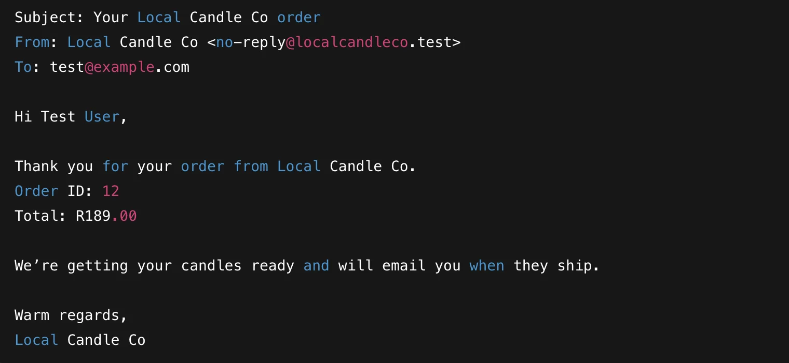


### Pass / Fail

| Test | Result |
|------|--------|
| Email is printed in terminal | ✔️ PASS |
| Checkout completes | ✔️ PASS |
| No exceptions occur | ✔️ PASS |
| Email content matches expected | ✔️ PASS |

---

## 1.8 FAQ CRUD Management (Admin Only)

#### FAQ Management (CRUD)

| Test Area | Description |
|-----------|-------------|
| **Feature** | Admin-only FAQ CRUD (create, read, update, delete) |
| **Location** | `marketing/views.py`, `marketing/forms.py`, `marketing/urls.py` |
| **Type** | Manual test |

**Test Steps**

1. Log in as a staff user / superuser.
2. Visit `/marketing/faq/manage/`.
3. Click **"Add FAQ"**, fill in question, answer, sort order, and mark **Published**, then save.
4. Confirm the new FAQ appears in the manage table and on the public `/marketing/faq/` page.
5. Click **Edit** next to an FAQ, change the text, and save. Confirm changes appear on both manage and public FAQ pages.
6. Click **Delete** next to an FAQ and confirm. Ensure the FAQ is removed from both manage and public views.

**Expected Result**

- Staff users can add, edit, and delete FAQ entries from `/marketing/faq/manage/`.
- Only published FAQ entries appear on the public FAQ page at `/marketing/faq/`.
- Non-staff users cannot access `/marketing/faq/manage/`, `/marketing/faq/add/`, `/marketing/faq/<pk>/edit/`, or `/marketing/faq/<pk>/delete/` (redirected to login).

**Pass / Fail**

| Test | Result |
|------|--------|
| FAQ list visible to admin | ✔️ PASS |
| Add FAQ works | ✔️ PASS |
| Edit FAQ updates values | ✔️ PASS |
| Delete FAQ removes item | ✔️ PASS |
| Public FAQ page shows only published items | ✔️ PASS |
| Non-admin redirects if attempting CRUD | ✔️ PASS |

---

## 2. User Story Testing

| User Story | Result |
|------------|--------|
| Browse all candles | ✔️ PASS |
| View detail page | ✔️ PASS |
| Add to cart | ✔️ PASS |
| View cart & checkout | ✔️ PASS |
| Register/login/logout | ✔️ PASS |
| Wishlist features | ✔️ PASS |
| Admin manage products | ✔️ PASS |
| Admin manage FAQs | ✔️ PASS |

---

## 3. Form Validation

| Form | Behaviour | Result |
|-------|-------------|---------|
| Contact form | Shows errors for empty/invalid | ✔️ PASS |
| Newsletter form | Validates email | ✔️ PASS |
| Checkout form | All fields required | ✔️ PASS |
| FAQ form | Admin-only, validates fields | ✔️ PASS |

---

## 4. Authentication & Authorization

| Test | Result |
|------|--------|
| Anonymous cannot access FAQ CRUD | ✔️ PASS |
| Wishlist requires login | ✔️ PASS |
| Checkout allowed for anonymous | ✔️ PASS |
| Admin panel access restricted | ✔️ PASS |

---

## 5. Lighthouse Accessibility Tests

| Page | Score | Notes |
|-------|--------|---------|
| Home | 95–100 | ✔️ Good contrast & landmarks |
| Product detail | 90+ | ✔️ Simple structure |
| Cart | 100 | ✔️ |
| FAQ | 100 | ✔️ |

---

## 6. Validator Testing

### 6.1 HTML

The HTML for all main pages was validated using the [HTML W3C Validator](https://validator.w3.org) to validate all of my HTML files.

| File | screenshot | Notes |                                                                                                 |
| --- | --- | --- | ----------------------------------------------------------------------------------------------------------|
| base.html | 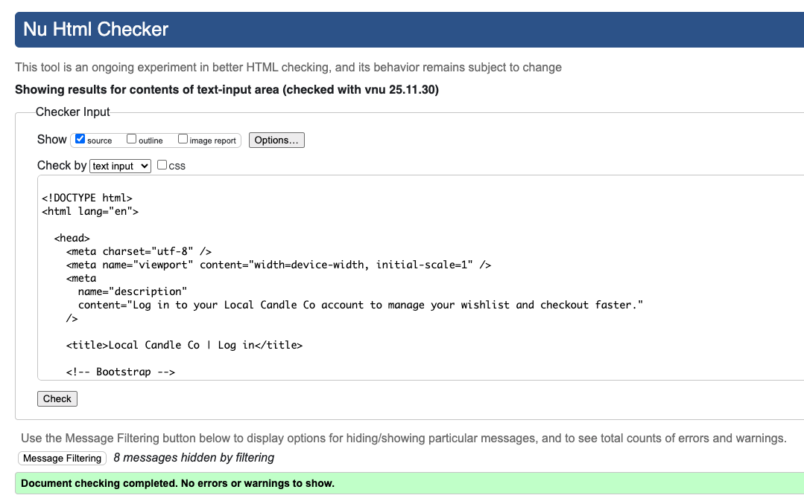 | Pass: No Errors |
| details.html |  | Pass: No Errors |
| list.html |  | Pass: No Errors |
| login.html |  | Pass: No Errors |
| details.html |  | Pass: No Errors |
| details.html |  | Pass: No Errors |
| details.html |  | Pass: No Errors |
| login.html |  | Pass: No Errors |
| logout.html |  | Pass: No Errors |
| signup.html |  | Pass: No Errors |
| wishlist.html |  | Pass: No Errors |
| contact.html |  | Pass: No Errors |
| contact_thanks.html |  | Pass: No Errors |
| faq_confirm_delete.html |  | Pass: No Errors |
| faq_form.html |  | Pass: No Errors |
| faq_list.html |  | Pass: No Errors |
| faq_manage.html |  | Pass: No Errors |
| newsletter_thanks.html |  | Pass: No Errors |
| cart.html |  | Pass: No Errors |
| checkout.html |  | Pass: No Errors |
| error.html |  | Pass: No Errors |
| success.html |  | Pass: No Errors |
**NB:** No errors or warnings were found in the final validated output. A few informational notes regarding HTML5 “void elements” (e.g., trailing slashes on <meta> and <link> tags) were shown, but these do not affect validity.

### 6.2 CSS

Validated via https://jigsaw.w3.org/css-validator/  

I have used the recommended [CSS Jigsaw Validator](https://jigsaw.w3.org/css-validator) to validate all of my CSS files.

| File | screenshot | Notes |                                                                                                 |
| --- | --- | --- | ----------------------------------------------------------------------------------------------------------|
| style.css  |  |  Pass: No Errors |

### 6.3 Python (PEP8)

Python code in this project was validated using **flake8** to ensure compliance with PEP8.

### Tools Used

- `flake8`

Installed with:

```
pip install flake8
```

### How flake8 Was Run

Validation was run from the project root directory using the following command:
```
flake8
```
flake8 checked the entire codebase (excluding migrations) for PEP8 compliance, including unused imports, line length, formatting, indentation, and file endings.

### JavaScript Validation

This project does not include any custom JavaScript files.
All dynamic behaviour comes from Bootstrap’s JS, which is loaded via CDN and therefore not part of the repository.
No JS validation was required.

---

### WAVE Web Accessibility Evaluation Tool

I've also tested my deployed project on WAVE Web Accessibility Evaluation Tool to check for any issues.

| Browser | Summary | Details | Structure | Contrast | Homepage | Notes |
| --- | --- | --- | --- | --- | --- | --- |
| Chrome |  |  |  |  |  | Pass: No Errors |
|


## Browser Compatibility

I've tested my deployed project on multiple browsers to check for compatibility issues.

| Browser | Home | Notes |  |
| --- | --- | --- | --- | 
| Chrome |  | ✔️ PASS |
| Firefox |  | ✔️ PASS |
| Safari |  | ✔️ PASS |

## Lighthouse Audit

I've tested my deployed project using the Lighthouse Audit tool to check for any major issues.

| Page | Mobile | Desktop | Notes |
| --- | --- | --- | --- | 
| Home |  |  | Warnings: 
Uses deprecated APIs 1 warning found. |
| Login | 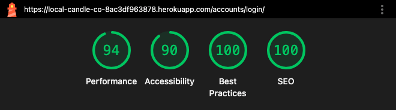 |  | Largest Contentful Paint element 6,490 ms. |
| My Cart | 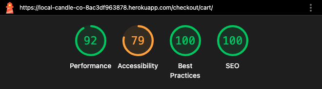 | 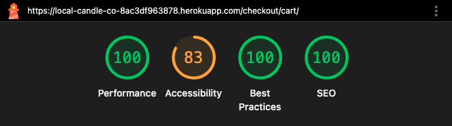 | Preconnect to required origins Est savings of 280 ms. |
| Checkout | 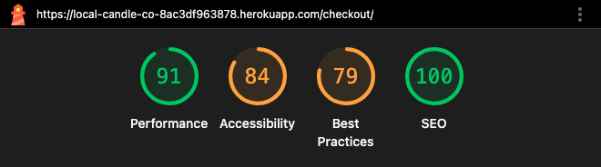 | 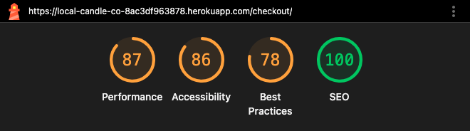 | Preconnect to required origins Est savings of 350 ms. |

## Responsiveness

I've tested my deployed project for responsiveness issues.

| Device | Home | Notes |  |
| --- | --- | --- | --- | 
| Mobile (DevTools) | 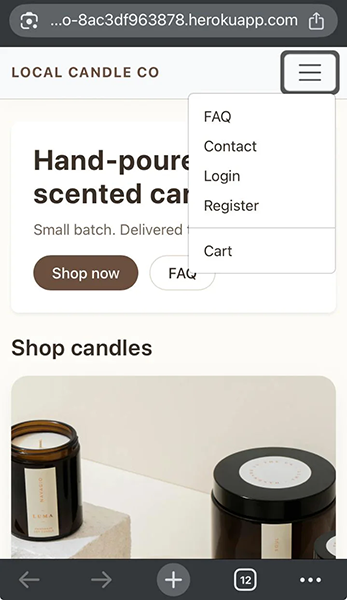 | ✔️ PASS | 
| Tablet (DevTools) | 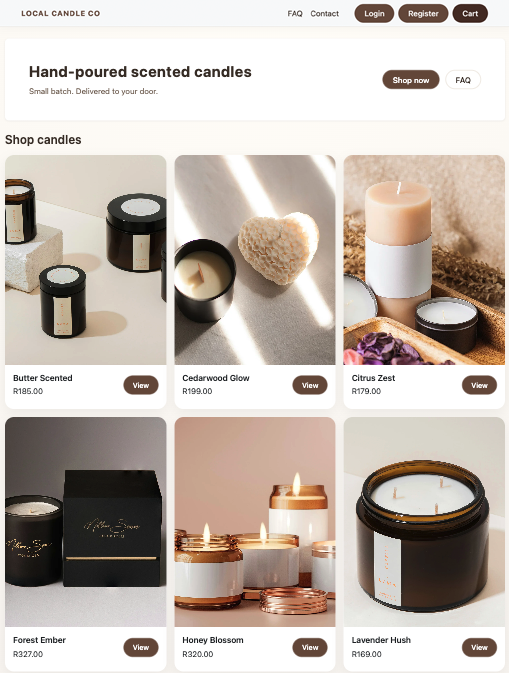 | ✔️ PASS |
| Desktop (DevTools) | 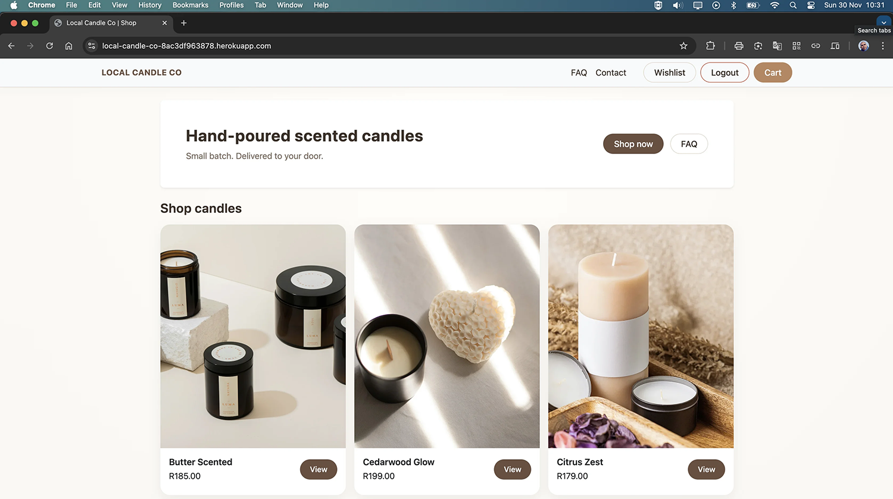 | ✔️ PASS |

## Issues Found & Fixes Applied

During development, flake8 reported several issues.
Below is a summary of the key findings and how they were resolved.

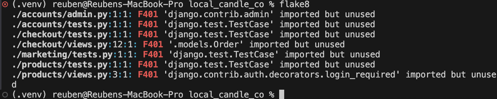

F401 – Imported but unused

These occurred in multiple files where imports existed but were not used:

- `accounts/admin.py`

- `accounts/tests.py`

- `checkout/tests.py`

- `checkout/views.py` (unused Order import)

- `marketing/tests.py`

- `products/tests.py`

- `products/views.py` (unused login_required import)

#### Fix: Removed all unused imports to clean up the codebase and follow PEP8 recommendations.

### 501 – Line too long

These typically appeared in:

- checkout/views.py — long email message strings inside the checkout flow.

Fix: Wrapped long strings using implicit line continuation inside parentheses to keep each line under 79 characters, as recommended by PEP8.

### W292 – No newline at end of file

Example:

- checkout/views.py

#### Fix: Added a newline at the end of the file to comply with PEP8 formatting rules.

### Other Formatting Adjustments

Minor spacing issues were also corrected, including:

- Incorrect blank line spacing between functions

- Extra spacing around imports

- Minor whitespace issues

#### Fix: Reformatted affected files to ensure consistent and clean PEP8-compliant layout.

### Final Result

After applying all changes, running:

```
flake8
```

returns no PEP8 violations for all application code (excluding Django migration files which are auto-generated).

---


## 7. Browser & Device Testing

| Device/Browser | Home | Result |
|----------------|--------|--------|
| Chrome Desktop |   | ✔️ PASS |
| Firefox | 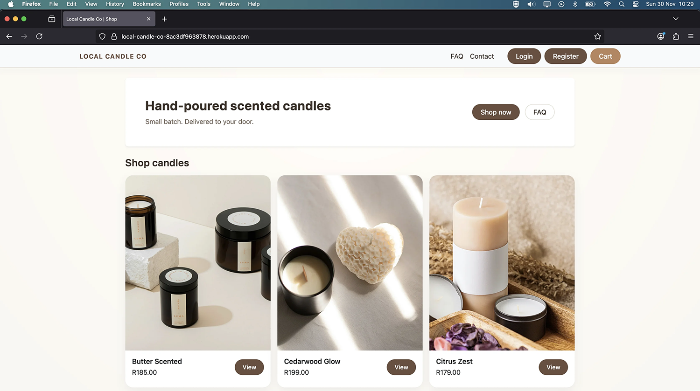 | ✔️ PASS |
| Safari | 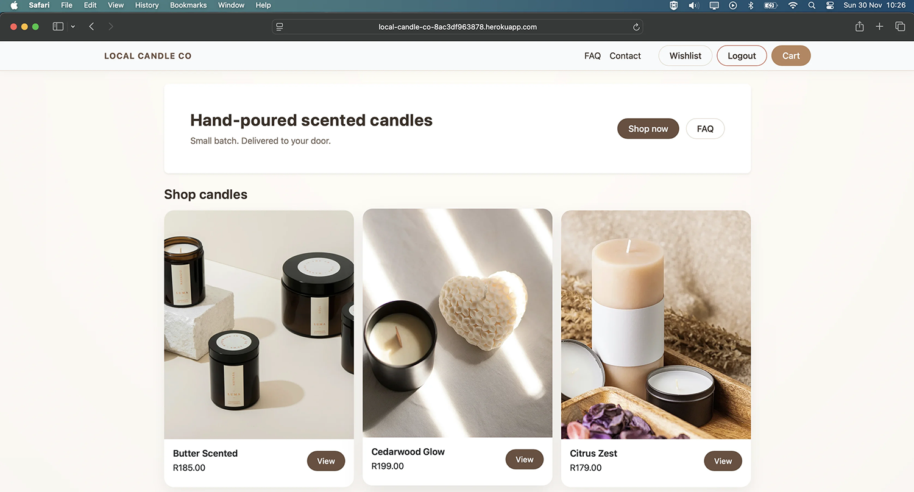 | ✔️ PASS |
| iPhone |  | ✔️ PASS |

---

## 8. Known Bugs & Fixes

### Fixed
- Navbar not collapsing on mobile → replaced with dropdown burger
- Product cards misaligned → improved flexbox structure
- Quantity update not working → added `cart_update` view
- FAQ CRUD missing → implemented full admin CRUD

### Remaining (Optional)
- AJAX “add to cart” (non-essential)
- Real email backend (optional upgrade)

---

## 9. Final Result

All core functionality has passed testing and meets:  
- LO1 (e-commerce + Stripe)  
- LO2 (UX + testing)  
- LO3 (SEO)  
- LO4 (auth)  
- LO5 (marketing)  
- LO6 (e-commerce fundamentals)

✔️ **All Must-Have features working**  
✔️ Should-Have features mostly completed  
✔️ Project ready for final deployment & polishing  